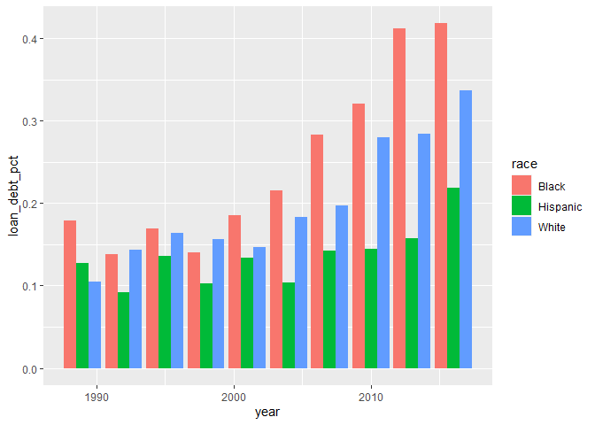
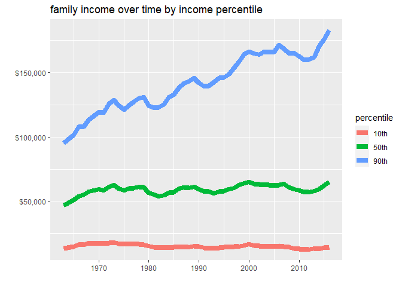
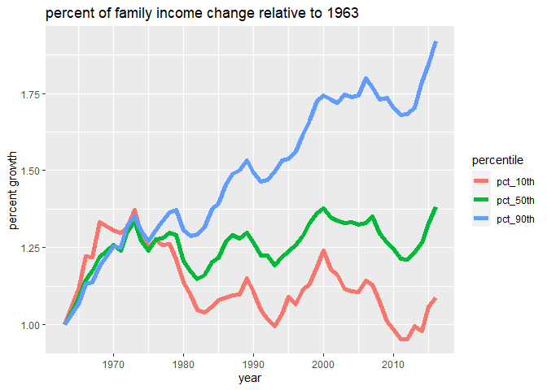
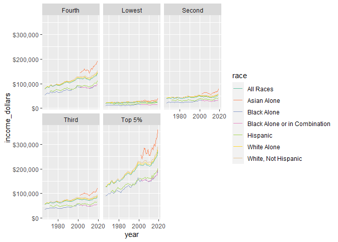
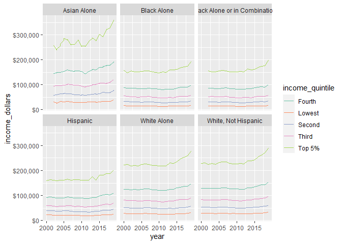
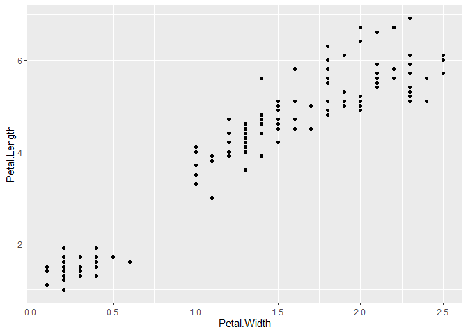
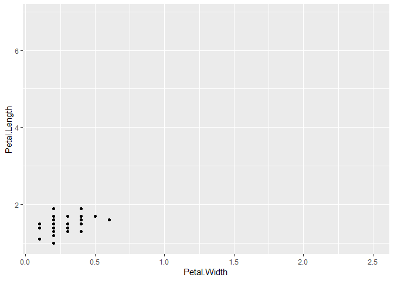

```r
library(tidyverse)
library(tidytuesdayR)
library(dplyr)
```


```r
tuesdata <- tidytuesdayR::tt_load(2021, week = 7)
```

```
## 
## 	Downloading file 1 of 11: `home_owner.csv`
## 	Downloading file 2 of 11: `income_aggregate.csv`
## 	Downloading file 3 of 11: `income_distribution.csv`
## 	Downloading file 4 of 11: `income_limits.csv`
## 	Downloading file 5 of 11: `income_mean.csv`
## 	Downloading file 6 of 11: `income_time.csv`
## 	Downloading file 7 of 11: `lifetime_earn.csv`
## 	Downloading file 8 of 11: `lifetime_wealth.csv`
## 	Downloading file 9 of 11: `race_wealth.csv`
## 	Downloading file 10 of 11: `retirement.csv`
## 	Downloading file 11 of 11: `student_debt.csv`
```


## Percent of student debt over time


```r
student_debt<- tuesdata$student_debt

student_debt %>% 
  ggplot(aes(year,loan_debt_pct, fill=race)) + 
  geom_col(position = "dodge")
```

<!-- -->
## Income distrubition over time


```r
income_time <- tuesdata$income_time

income_time %>%
  ggplot(aes(year, income_family, color=percentile))+
  geom_line(size=3)+
  labs(title="family income over time by income percentile",
       x="",
       y="")+
  scale_y_continuous(labels=scales::dollar_format())
```

<!-- -->

# By what percentage did the income change from its initial value over time?

```r
# setting initial incomes
initial_10 <- income_time$income_family[1]
initial_50 <- income_time$income_family[2]
initial_90 <- income_time$income_family[3]

income_time %>%
  pivot_wider(names_from = c(percentile), values_from = income_family) %>%
  mutate(pct_10th = `10th`/initial_10) %>%
  mutate(pct_50th = `50th`/initial_50) %>%
  mutate(pct_90th = `90th`/initial_90) %>%
  select(year,pct_10th:pct_90th) %>%
  pivot_longer(pct_10th:pct_90th,names_to = "percentile", values_to="pct_change_from_1963") %>%
  ggplot(aes(year,pct_change_from_1963,color=percentile))+
  geom_line(size=2)+
  labs(title="percent of family income change relative to 1963",
       x="year",
       y="percent growth")
```

<!-- -->


```r
income_limits <- tuesdata$income_limits
```


```r
income_limits %>%
  filter(dollar_type=="2019 Dollars") %>%
  #filter(income_quintile==c("Top 5%","Lowest"))%>%
  #filter(race== c("Asian Alone","White Alone","Black Alone"))%>%
  ggplot(aes(year,income_dollars,color=race)) +
  geom_line()+
  facet_wrap(.~income_quintile)+
  scale_y_continuous(labels=scales::dollar_format()) +
  scale_color_brewer(palette="Set2")
```

<!-- -->

```r
income_limits %>%
  filter(dollar_type=="2019 Dollars") %>%
  filter(race != "All Races") %>%
  filter(year>=2000)%>%
  ggplot(aes(year,income_dollars,color=income_quintile)) +
  geom_line()+
  facet_wrap(.~race)+
  scale_y_continuous(labels=scales::dollar_format()) +
  scale_color_brewer(palette="Set2")
```

<!-- -->
## Experimenting with animations


```r
library(ggplot2)
library(gganimate)
library(gifski)

anim <- ggplot(mtcars, aes(mpg, disp)) +
  transition_states(gear, transition_length = 2, state_length = 1) +
  enter_fade() +
  exit_fade()

if (FALSE) {
# Explicitly animate using default (same as just printing the animation)
animate(anim)

# Change duration and framerate
animate(anim, fps = 20, duration = 15)

# Make the animation pause at the end and then rewind
animate(anim, nframes = 100, end_pause = 10, rewind = TRUE)

# Use a different renderer
animate(anim, renderer = file_renderer('~/animation/'))[1:6]

# Specify device dimensions and/or resolution
animate(anim, height = 2, width = 3, units = "in", res = 150)
}
```


```r
library(gganimate)
#> Loading required package: ggplot2

# We'll start with a static plot
p <- ggplot(iris, aes(x = Petal.Width, y = Petal.Length)) +
  geom_point()

plot(p)
```

<!-- -->

```r
anim <- p +
  transition_states(Species,
                    transition_length = 2,
                    state_length = 1)

anim
```

<!-- -->

