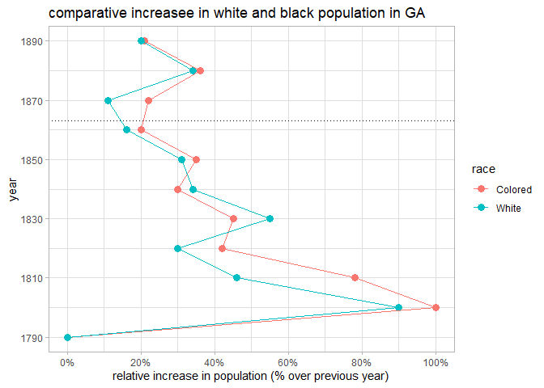

```r
library(tidyverse)
library(dplyr)
library(ggplot2)
library(tidytuesdayR)
```


```r
tuesdata <- tidytuesdayR::tt_load(2021, week = 8)
```

```
## 
## 	Downloading file 1 of 8: `freed_slaves.csv`
## 	Downloading file 2 of 8: `census.csv`
## 	Downloading file 3 of 8: `furniture.csv`
## 	Downloading file 4 of 8: `city_rural.csv`
## 	Downloading file 5 of 8: `income.csv`
## 	Downloading file 6 of 8: `occupation.csv`
## 	Downloading file 7 of 8: `conjugal.csv`
## 	Downloading file 8 of 8: `georgia_pop.csv`
```

```r
ga_pop <- tuesdata$georgia_pop
```


```r
ga_pop %>%
  pivot_longer(Colored:White,names_to="race",values_to="pop") %>%
  mutate(pop=pop/100) %>%
  ggplot(aes(Year,pop,color=race)) +
  geom_point() +
  geom_line()+
  labs(title="comparative increasee in white and black population in GA",
       x="year",
       y="relative increase in population (% over previous year)")+
  scale_y_continuous(labels = scales::percent)
```

<!-- -->

