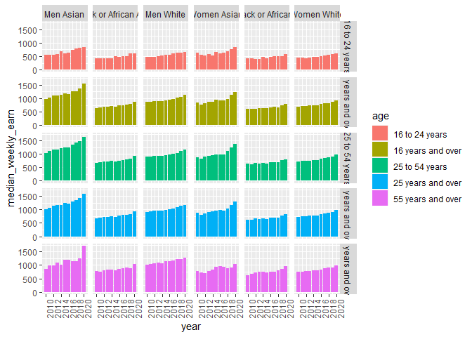

```r
library(tidytuesdayR)
library(tidyverse)
library(dplyr)
library(ggplot2)
```


```r
tuesdata <- tidytuesdayR::tt_load('2021-02-23')
```

```
## --- Compiling #TidyTuesday Information for 2021-02-23 ----
```

```
## --- There are 2 files available ---
```

```
## --- Starting Download ---
```

```
## 
## 	Downloading file 1 of 2: `earn.csv`
## 	Downloading file 2 of 2: `employed.csv`
```

```
## --- Download complete ---
```


```r
earn <- tuesdata$earn
employed <- tuesdata$employed
```


```r
employed_clean <- employed %>%
  mutate(dimension = case_when(
    race_gender == "TOTAL" ~ "Total",
    race_gender %in% c("Men", "Women") ~ "Gender",
    TRUE ~ "Race"
  ))
```


```r
earn %>%
  filter(race != "All Races") %>%
  filter(sex != "Both Sexes")%>%
  mutate(sex_race = paste(sex,race))%>%
  ggplot(aes(year,median_weekly_earn,fill=age))+
  geom_col(position="dodge")+
  scale_x_continuous(breaks=c(2010,2012,2014,2016,2018,2020))+
  theme(axis.text.x = element_text(angle = 90))+
  facet_grid(vars(age),vars(sex_race))
```

<!-- -->


