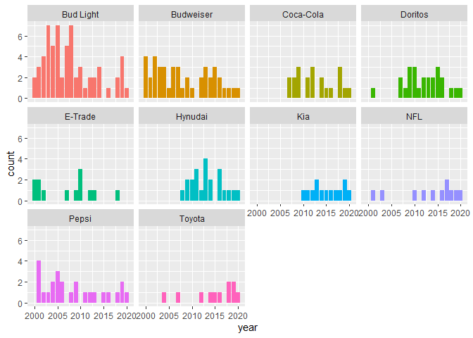

First, load packages.


```r
library(tidyverse)
library(ggplot2)
library(dplyr)
library(tidytuesdayR)
library(scales)
```

Second, grab the data.


```r
tuesdata <- tidytuesdayR::tt_load('2021-03-02')
```

```
## 
## 	Downloading file 1 of 1: `youtube.csv`
```

```r
youtube<- tuesdata$youtube
```

Look at the data.

```r
summary(youtube)
```

```
##       year         brand           superbowl_ads_dot_com_url youtube_url       
##  Min.   :2000   Length:247         Length:247                Length:247        
##  1st Qu.:2005   Class :character   Class :character          Class :character  
##  Median :2010   Mode  :character   Mode  :character          Mode  :character  
##  Mean   :2010                                                                  
##  3rd Qu.:2015                                                                  
##  Max.   :2020                                                                  
##                                                                                
##    funny         show_product_quickly patriotic       celebrity      
##  Mode :logical   Mode :logical        Mode :logical   Mode :logical  
##  FALSE:76        FALSE:78             FALSE:206       FALSE:176      
##  TRUE :171       TRUE :169            TRUE :41        TRUE :71       
##                                                                      
##                                                                      
##                                                                      
##                                                                      
##    danger         animals         use_sex             id           
##  Mode :logical   Mode :logical   Mode :logical   Length:247        
##  FALSE:172       FALSE:155       FALSE:181       Class :character  
##  TRUE :75        TRUE :92        TRUE :66        Mode  :character  
##                                                                    
##                                                                    
##                                                                    
##                                                                    
##      kind               etag             view_count          like_count    
##  Length:247         Length:247         Min.   :       10   Min.   :     0  
##  Class :character   Class :character   1st Qu.:     6431   1st Qu.:    19  
##  Mode  :character   Mode  :character   Median :    41379   Median :   130  
##                                        Mean   :  1407556   Mean   :  4146  
##                                        3rd Qu.:   170016   3rd Qu.:   527  
##                                        Max.   :176373378   Max.   :275362  
##                                        NA's   :16          NA's   :22      
##  dislike_count     favorite_count comment_count    
##  Min.   :    0.0   Min.   :0      Min.   :   0.00  
##  1st Qu.:    1.0   1st Qu.:0      1st Qu.:   1.00  
##  Median :    7.0   Median :0      Median :  10.00  
##  Mean   :  833.5   Mean   :0      Mean   : 188.64  
##  3rd Qu.:   24.0   3rd Qu.:0      3rd Qu.:  50.75  
##  Max.   :92990.0   Max.   :0      Max.   :9190.00  
##  NA's   :22        NA's   :16     NA's   :25       
##   published_at                    title           description       
##  Min.   :2006-02-06 10:02:36   Length:247         Length:247        
##  1st Qu.:2009-02-02 03:59:35   Class :character   Class :character  
##  Median :2013-01-31 09:13:55   Mode  :character   Mode  :character  
##  Mean   :2012-12-23 22:41:37                                        
##  3rd Qu.:2016-04-09 11:09:50                                        
##  Max.   :2021-01-27 13:11:29                                        
##  NA's   :16                                                         
##   thumbnail         channel_title       category_id   
##  Length:247         Length:247         Min.   : 1.00  
##  Class :character   Class :character   1st Qu.:17.00  
##  Mode  :character   Mode  :character   Median :23.00  
##                                        Mean   :19.32  
##                                        3rd Qu.:24.00  
##                                        Max.   :29.00  
##                                        NA's   :16
```
How many ads per year?

```r
youtube %>%
  count(year) %>%
  ggplot(aes(year,n))+
  geom_line() +
  scale_y_continuous(expand=c(0,0),limits = c(0,15))+
  labs(title="# of superbowl commercials per year",
       x="year",
       y="# of superbowl ads")
```

<!-- -->

```r
youtube %>%
  filter(!is.na(brand))%>%
  mutate(brand=fct_lump(brand,4))%>%
  count(brand,year) %>%
  ggplot(aes(year,n)) +
  geom_col() +
  facet_grid(vars(brand))+
  labs(title="# of commercials per year, by category")
```

<!-- -->
How well-liked (or disliked) are certain commercials?

```r
youtube%>%
  filter(dislike_count >0) %>%
  mutate(brand=fct_lump(brand,4))%>%
  mutate(L_D = like_count/dislike_count) %>%
  ggplot(aes(L_D,view_count,color=brand,size=view_count)) +
  geom_point()+
  scale_y_log10()+
  facet_grid(vars(use_sex))+
  labs(title="ratio of (like)/(dislike) vs. view count on youtube",
  subtitle = "FALSE = commercial does not use sex)")
```

<!-- -->

It appears engagement is very low. The ratio of `likes/views` hovers just under `1%`, regardless of the brand, use of sex in the commercial, and/or brand.  

```r
youtube%>%
  filter(dislike_count >0) %>%
  mutate(brand=fct_lump(brand,4))%>%
  mutate(D_V = dislike_count/view_count) %>%
  ggplot(aes(D_V,view_count,color=brand,size=view_count)) +
  geom_point()+
  scale_y_log10()+
  scale_x_continuous(labels=percent)+
  facet_grid(vars(use_sex))+
  labs(title="ratio of (dislikes)/(views) vs. view count on youtube",
  subtitle = "FALSE = commercial does not use sex)")
```

<!-- -->

```r
youtube%>%
  filter(dislike_count >0) %>%
  mutate(brand=fct_lump(brand,4))%>%
  mutate(L_V = like_count/view_count) %>%
  ggplot(aes(L_V,view_count,color=brand,size=view_count)) +
  geom_point()+
  scale_y_log10()+
  scale_x_continuous(labels=percent)+
  facet_grid(vars(use_sex))+
  labs(title="ratio of (likes)/(views) vs. view count on youtube",
  subtitle = "FALSE = commercial does not use sex)")
```

<!-- -->
Following along with David Robinson

```r
youtube %>% 
  count(brand,sort=TRUE) %>%
  mutate(brand=fct_reorder(brand,n)) %>%
  ggplot(aes(n,brand))+
  geom_col()
```

<!-- -->

```r
youtube %>%
  ggplot(aes(year,fill=brand))+
  geom_bar() +
  facet_wrap(~ brand)+
  theme(legend.position="none")
```

<!-- -->


```r
youtube %>%
  gather(metric,value,contains("_count"))%>%
  ggplot(aes(value))+
  geom_histogram(binwidth=.5)+
  scale_x_log10(labels=comma)+
  facet_wrap(~metric)+
  labs(x="number of views")
```

```
## Warning: Transformation introduced infinite values in continuous x-axis
```

```
## Warning: Removed 429 rows containing non-finite values (stat_bin).
```

<!-- -->


```r
youtube %>%
  filter(!is.na(view_count))%>%
  mutate(brand=fct_reorder(brand,view_count))%>%
  ggplot(aes(view_count,brand, fill=funny))+
  geom_boxplot()+
  scale_x_log10(labels=comma)
```

<!-- -->

median views per year

```r
youtube %>%
  filter(!is.na(view_count)) %>%
  group_by(year)%>%
  summarize(n=n(),
            median_views=median(view_count))%>%
  ggplot(aes(year,median_views))+
  geom_line()+
  geom_point(aes(size=n))+
  theme(legend.position = "none")+
  scale_y_log10(labels=comma)
```

```
## `summarise()` ungrouping output (override with `.groups` argument)
```

<!-- -->


```r
youtube %>%
  gather(category,value, funny:use_sex)%>%
  ggplot(aes(category,view_count, fill=value))+
  geom_boxplot()+
  scale_y_log10()
```

```
## Warning: Removed 112 rows containing non-finite values (stat_boxplot).
```

<!-- -->


```r
youtube %>%
  filter(!is.na(view_count))%>%
  gather(category,value, funny:use_sex)%>%
  group_by(category,value) %>%
  summarize(n=n(),
            median_view_count=median(view_count)) %>%
  ggplot(aes(category,median_view_count, fill=value))+
  geom_col(position="dodge")
```

```
## `summarise()` regrouping output by 'category' (override with `.groups` argument)
```

<!-- -->

Correlations between value and the log of the view count.

```r
youtube %>%
  filter(!is.na(view_count))%>%
  gather(category,value, funny:use_sex)%>%
  group_by(category) %>%
  summarize(correlation = cor(value,log(view_count+1))) %>%
  arrange(desc(correlation))
```

```
## `summarise()` ungrouping output (override with `.groups` argument)
```

```
## # A tibble: 7 x 2
##   category             correlation
##   <chr>                      <dbl>
## 1 danger                   0.107  
## 2 funny                    0.0686 
## 3 show_product_quickly     0.0348 
## 4 patriotic                0.0255 
## 5 celebrity                0.00303
## 6 animals                 -0.0295 
## 7 use_sex                 -0.0520
```


```r
lm(log2(view_count) ~ danger+patriotic,
   data=youtube) %>%
  summary()
```

```
## 
## Call:
## lm(formula = log2(view_count) ~ danger + patriotic, data = youtube)
## 
## Residuals:
##      Min       1Q   Median       3Q      Max 
## -11.6605  -2.4920   0.4279   2.2865  12.8648 
## 
## Coefficients:
##               Estimate Std. Error t value Pr(>|t|)    
## (Intercept)    14.5292     0.3499  41.528   <2e-16 ***
## dangerTRUE      0.9889     0.5775   1.712   0.0882 .  
## patrioticTRUE   0.4532     0.7042   0.644   0.5205    
## ---
## Signif. codes:  0 '***' 0.001 '**' 0.01 '*' 0.05 '.' 0.1 ' ' 1
## 
## Residual standard error: 4 on 228 degrees of freedom
##   (16 observations deleted due to missingness)
## Multiple R-squared:  0.01332,	Adjusted R-squared:  0.004662 
## F-statistic: 1.539 on 2 and 228 DF,  p-value: 0.2169
```

