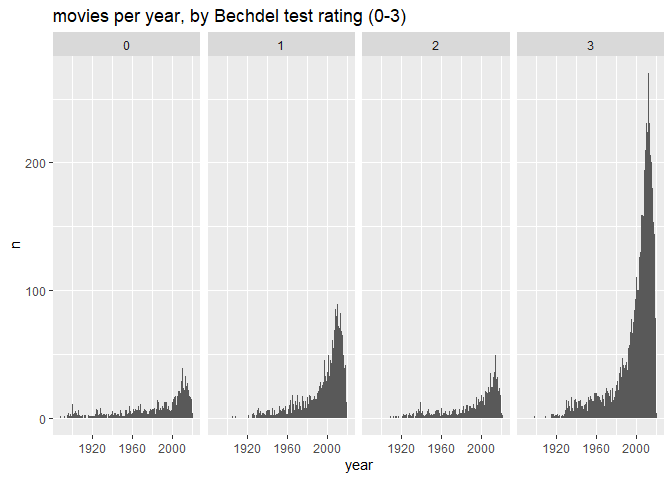
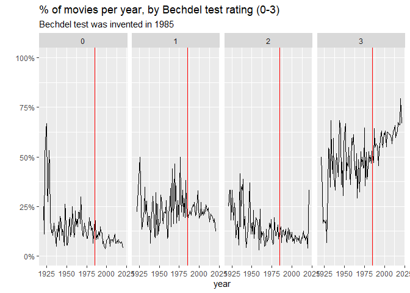

First, load packages.


```r
library(tidyverse)
library(ggplot2)
library(dplyr)
library(tidytuesdayR)
library(scales)
```

Second, grab the data.


```r
tuesdata <- tidytuesdayR::tt_load('2021-03-09')
```

```
## --- Compiling #TidyTuesday Information for 2021-03-09 ----
```

```
## --- There are 2 files available ---
```

```
## --- Starting Download ---
```

```
## 
## 	Downloading file 1 of 2: `raw_bechdel.csv`
## 	Downloading file 2 of 2: `movies.csv`
```

```
## --- Download complete ---
```

```r
raw_bechdel <- tuesdata$raw_bechdel
movies<- tuesdata$movies
```
How many movies per year?

```r
movies_per_year <- raw_bechdel %>%
  count(year)
movies_per_year_per_rating <- raw_bechdel %>%
  count(year, rating) 
```

How many movies per year and bechdel test rating?

```r
raw_bechdel %>%
  count(year, rating) %>%
  ggplot(aes(year,n))+
  geom_col()+
  facet_grid(.~rating) +
  labs(title="movies per year, by Bechdel test rating (0-3)") 
```

<!-- -->


Percent of movies each year with Bechdel test ratings (0-3)


```r
raw_bechdel_joined <- left_join(movies_per_year_per_rating,movies_per_year,by="year") %>%
  mutate(pct_with_rating = n.x/n.y) 
```


```r
raw_bechdel_joined %>%
  filter(year>1920)%>%
  ggplot(aes(year,pct_with_rating))+
  geom_line()+
  geom_vline(xintercept =1985, col="red")+
  facet_grid(.~rating) +
  labs(title="% of movies per year, by Bechdel test rating (0-3)",
       subtitle="Bechdel test was invented in 1985",
       y="")+
  scale_y_continuous(labels = scales::percent, limits=c(0,1))
```

<!-- -->
