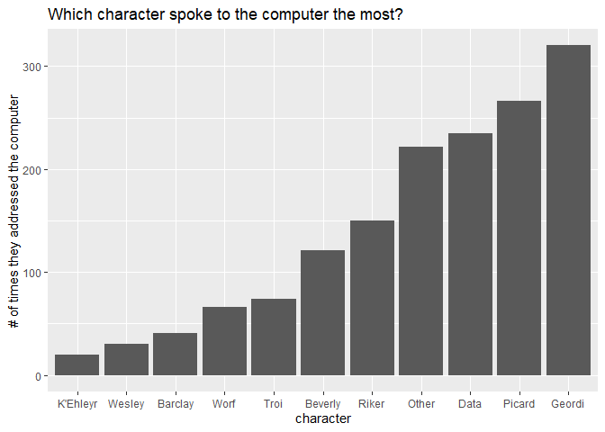

```r
# load packages
library(tidyverse)
library(ggplot2)
library(dplyr)
library(tidytuesdayR)
library(scales)
library(tidytext)
# get data
computer <- readr::read_csv('https://raw.githubusercontent.com/rfordatascience/tidytuesday/master/data/2021/2021-08-17/computer.csv')
```

Which character spoke to the computer the most?


```r
computer %>% 
  filter(char != "Computer Voice", char != "Computer") %>%
  count(char = fct_lump(char, 10))%>%
  arrange(desc(n)) %>%
  mutate(char=fct_reorder(char,n)) %>%
  ggplot(aes(char,n))+
  geom_col() +
  labs(title="Which character spoke to the computer the most?",
         x="character",
         y="# of times they addressed the computer")
```

<!-- -->


```r
computer %>% 
  filter(char != "Computer Voice", char != "Computer") %>%
  count(char = fct_lump(char, 10))%>%
  arrange(desc(n))
```

```
## # A tibble: 11 x 2
##    char         n
##    <fct>    <int>
##  1 Geordi     320
##  2 Picard     266
##  3 Data       235
##  4 Other      222
##  5 Riker      150
##  6 Beverly    121
##  7 Troi        74
##  8 Worf        66
##  9 Barclay     41
## 10 Wesley      30
## 11 K'Ehleyr    20
```

What words were most commonly spoken to the computer and who spoke them?


```r
 computer_lines <- computer %>%
  filter(char != "Computer Voice") %>%
  select(char,line) %>%
  unnest_tokens(word,line) %>%
  anti_join(get_stopwords()) %>%
  count(char,word,sort=TRUE)
```

```
## Joining, by = "word"
```

```r
computer_lines %>%
  filter(char !="Computer") %>%
  filter(word !="computer") %>%
  View()
```

A little data cleaning to get rid of parenthesis and text within parenthesis. 


```r
# first sweep to get rid of (all text in parenthesis) including the parenthesis!
computer$line<-  str_replace(computer$line,"\\s*\\([^\\)]+\\)","")

#second sweep to get rid of (all text in parenthesis) including the parenthesis!
computer$line<-  str_replace(computer$line,"\\s*\\([^\\)]+\\)","")

computer_ngram_2<- computer %>%
  filter(char != "Computer Voice") %>%
  filter(char != "Computer") %>%
  unnest_tokens(ngram, line, token = "ngrams", n = 3) %>%
  select(char,ngram) %>%
  count(ngram,sort=TRUE)

computer_ngram_2
```

```
## # A tibble: 5,754 x 2
##    ngram                       n
##    <chr>                   <int>
##  1 <NA>                      147
##  2 computer end program       20
##  3 computer freeze program    19
##  4 computer what is           18
##  5 what is the                18
##  6 all command functions      17
##  7 computer this is           17
##  8 a little more              16
##  9 auto destruct sequence     16
## 10 can you extrapolate        16
## # ... with 5,744 more rows
```


