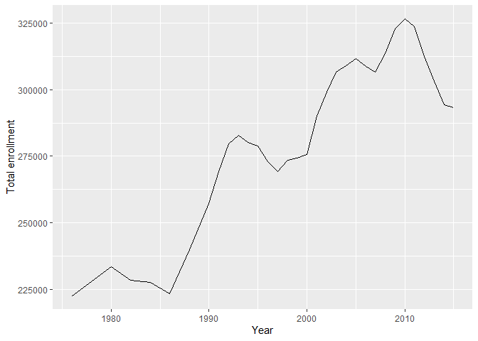
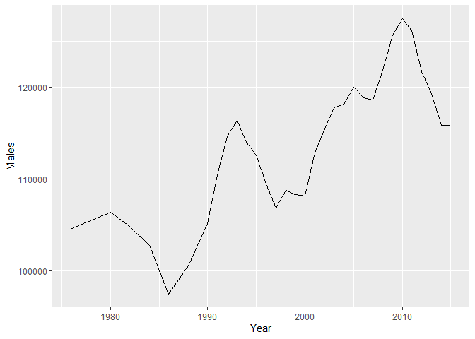
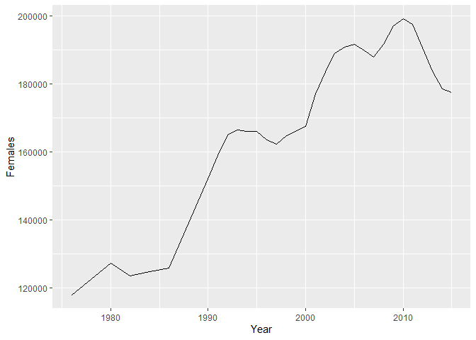
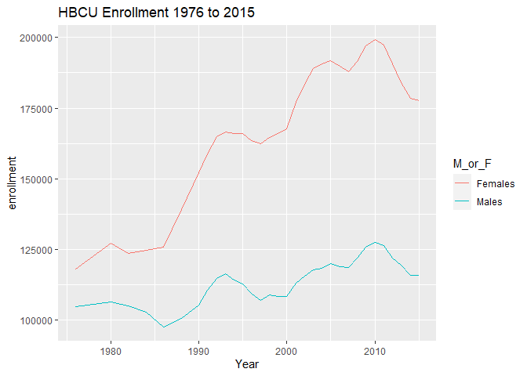
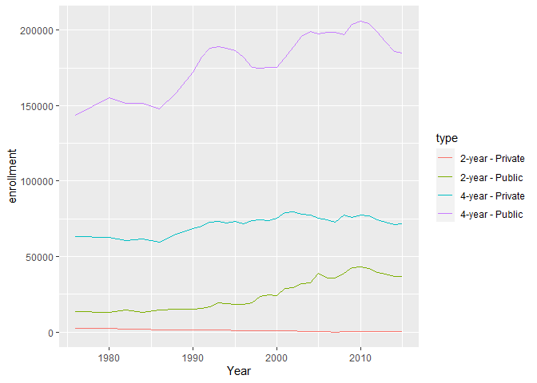
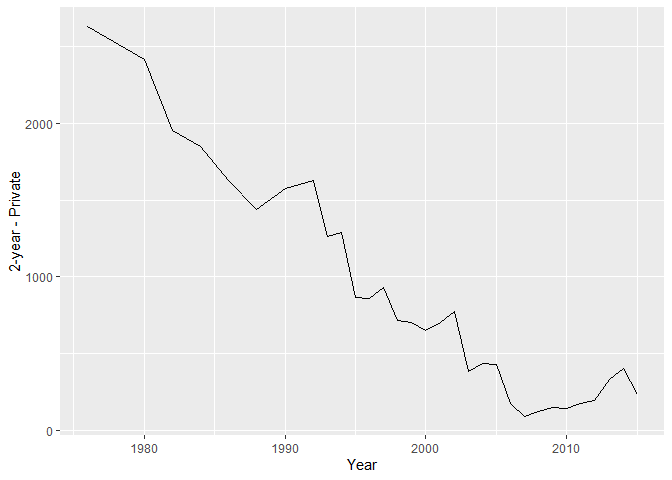

```r
library(tidyverse)
library(ggplot2)
library(dplyr) 
library(readr)
```


```r
# get the data
hbcu_all <- readr::read_csv('https://raw.githubusercontent.com/rfordatascience/tidytuesday/master/data/2021/2021-02-02/hbcu_all.csv')

hbcu_hs <- readr::read_csv('https://raw.githubusercontent.com/rfordatascience/tidytuesday/master/data/2021/2021-02-02/hs_students.csv')
```

Plot enrollment over time

```r
hbcu_all %>%
  ggplot(aes(Year,`Total enrollment`)) +
  geom_line()
```

<!-- -->

```r
hbcu_all %>%
  ggplot(aes(Year,Males)) +
  geom_line()
```

<!-- -->


```r
hbcu_all %>%
  ggplot(aes(Year,Females)) +
  geom_line()
```

<!-- -->


```r
hbcu_all_m_or_f<- hbcu_all %>%
  select(Year:Females) %>%
  pivot_longer(Males:Females,names_to="M_or_F",values_to = "enrollment")

hbcu_all_m_or_f %>%
  ggplot(aes(Year,enrollment,color=M_or_F)) +
  geom_line()+
  labs(title="HBCU Enrollment 1976 to 2015")
```

<!-- -->

Tracking 4-year private and public, 2-year private and public, over time. 


```r
hbcu_all_type<- hbcu_all %>% 
  select(Year,`4-year - Public`,`4-year - Private`,`2-year - Public`,`2-year - Private`) %>%
  pivot_longer(`4-year - Public`:`2-year - Private`,names_to = "type",values_to ="enrollment")
  
hbcu_all_type %>%
  ggplot(aes(Year,enrollment,color=type)) +
  geom_line()
```

<!-- -->

Let's zoom in on 2-year private


```r
hbcu_all %>% 
  select(Year,`2-year - Private`) %>%
  ggplot(aes(Year,`2-year - Private`))+
  geom_line()
```

<!-- -->

