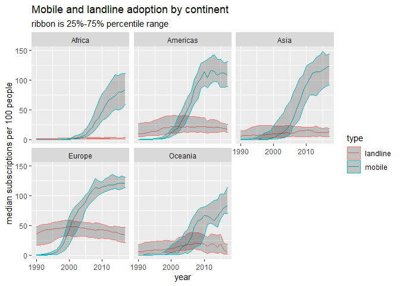

# tidytuesday
A social data science project from the R user community.

* 2021 02 09 [wealth inequality data](/2021_02_09_wealth_inequality/wealth-inequality.md)

* 2021 02 01 [HBCU data](/HBCU/HBCU.md)

* 2020 11 10 [Historical Phones](historical_phones/historical_phones.md)

* 2020 05 12 [Volcanoes](volcano/volcano.md) (following along with Julia Silge's video)

* 2020 05 05 [Animal Crossing](/animal_crossing/animal_crossing.md) (work in progress)

* 2020 04 07 [Tour de France](/tour_de_france/tour_de_france.md) (work in progress)

* 2019 10 28 [Squirrel Census](/squirrel_census/squirrel_census.md) and rpubs link: https://rpubs.com/joedinoto/squirrel_census 

