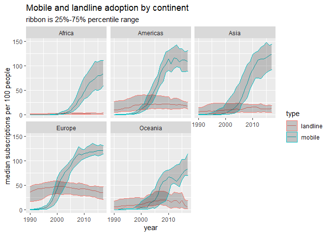

# Get the data

Source: https://github.com/rfordatascience/tidytuesday/blob/master/data/2020/2020-11-10/readme.md4
David Robinson's video: https://www.youtube.com/watch?v=pJPqAIb8MKA


```r
# load libraries
library(tidyverse)
library(ggplot2)
library(scales)

# load data
mobile <- readr::read_csv('https://raw.githubusercontent.com/rfordatascience/tidytuesday/master/data/2020/2020-11-10/mobile.csv')
landline <- readr::read_csv('https://raw.githubusercontent.com/rfordatascience/tidytuesday/master/data/2020/2020-11-10/landline.csv')
```

Merge the data sets: 


```r
mobile_rn <- mobile %>%
  rename(subscriptions=mobile_subs) %>%
  mutate(type="mobile")

landline_rn <- landline %>%
  rename(subscriptions=landline_subs) %>%
  mutate(type="landline")

phones <- bind_rows(mobile_rn,landline_rn) %>%
  rename(country=entity)
```

# Graph some stuff!


```r
phones %>% filter(country=="United States") %>%
  ggplot(aes(year,subscriptions,color=type)) +
  geom_line()
```

```
## Warning: Removed 2 row(s) containing missing values (geom_path).
```

<!-- -->


```r
phones %>% filter(country=="China") %>%
  ggplot(aes(year,subscriptions,color=type)) +
  geom_line()
```

```
## Warning: Removed 2 row(s) containing missing values (geom_path).
```

<!-- -->


```r
phones %>% filter(country=="Australia") %>%
  ggplot(aes(year,subscriptions,color=type)) +
  geom_line()
```

```
## Warning: Removed 2 row(s) containing missing values (geom_path).
```

<!-- -->


```r
phones %>% 
  ggplot(aes(year,
             subscriptions,
             color=type,
             group=interaction(type,country))) +
  geom_line()
```

```
## Warning: Removed 1827 row(s) containing missing values (geom_path).
```

<!-- -->


```r
country_sizes <- phones %>%
  group_by(country) %>%
  summarize(avg_population = mean(total_pop,na.rm = TRUE)) %>%
  arrange(desc(avg_population))
```

```
## `summarise()` ungrouping output (override with `.groups` argument)
```


```r
phones %>% 
  semi_join(country_sizes %>% top_n(10,avg_population),by="country") %>%
  ggplot(aes(year,
             subscriptions,
             color=type,
             group=interaction(type,country))) +
  geom_line()
```

```
## Warning: Removed 20 row(s) containing missing values (geom_path).
```

<!-- -->


```r
phones %>% 
  semi_join(country_sizes %>% top_n(10,avg_population),by="country") %>%
  ggplot(aes(year,
             subscriptions,
             color=type,
             group=interaction(type,country))) +
  geom_line() +
  facet_wrap(~continent)
```

```
## Warning: Removed 20 row(s) containing missing values (geom_path).
```

<!-- -->


```r
phones %>% 
  semi_join(country_sizes %>% top_n(50,avg_population),by="country") %>%
  ggplot(aes(year,
             subscriptions,
             color=type,
             group=interaction(type,country))) +
  geom_line() +
  facet_wrap(~continent)
```

```
## Warning: Removed 155 row(s) containing missing values (geom_path).
```

<!-- -->


```r
phones %>% 
  filter(!is.na(subscriptions)) %>%
  group_by(year,continent,type) %>%
  summarise(avg_subs = mean(subscriptions)) %>%
  ggplot(aes(year,
             avg_subs,
             color=type)) +
  geom_line() +
  facet_wrap(~continent)
```

```
## `summarise()` regrouping output by 'year', 'continent' (override with `.groups` argument)
```

<!-- -->


```r
phones %>% 
  filter(!is.na(subscriptions)) %>%
  group_by(year,continent,type) %>%
  summarise(avg_subs = mean(subscriptions),
            q25=quantile(subscriptions,.25),
            q75=quantile(subscriptions,.75)) %>%
  ggplot(aes(year,
             avg_subs,
             color=type)) +
  geom_line() +
  geom_ribbon(aes(ymin=q25,ymax=q75),alpha=.25)+
  facet_wrap(~continent)
```

```
## `summarise()` regrouping output by 'year', 'continent' (override with `.groups` argument)
```

<!-- -->


```r
phones %>% 
  filter(!is.na(subscriptions)) %>%
  group_by(year,continent,type) %>%
  summarise(avg_subs = median(subscriptions),  # change to median
            q25=quantile(subscriptions,.25),
            q75=quantile(subscriptions,.75)) %>%
  ggplot(aes(year,
             avg_subs,
             color=type)) +
  geom_line() +
  geom_ribbon(aes(ymin=q25,ymax=q75),alpha=.25)+
  facet_wrap(~continent) +
  labs(x="year",
       y="median subscriptions per 100 people",
       title = "Mobile and landline adoption by continent",
       subtitle = "ribbon is 25%-75% percentile range")
```

```
## `summarise()` regrouping output by 'year', 'continent' (override with `.groups` argument)
```

<!-- -->
