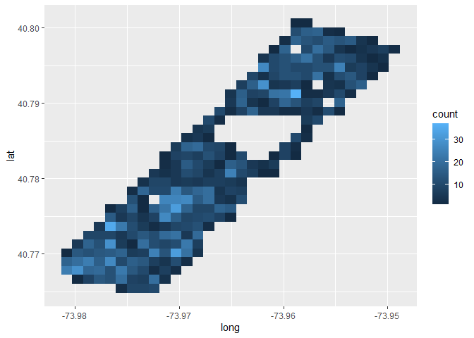
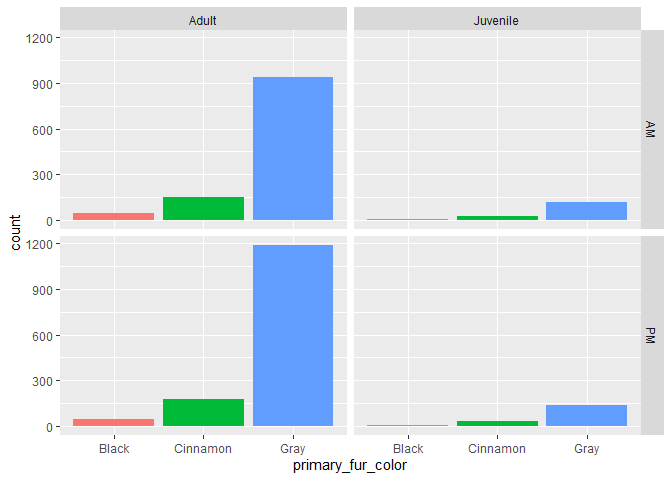
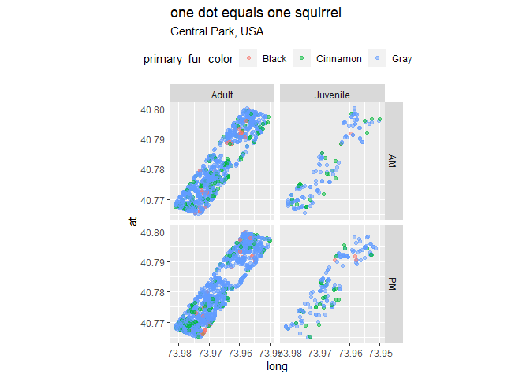
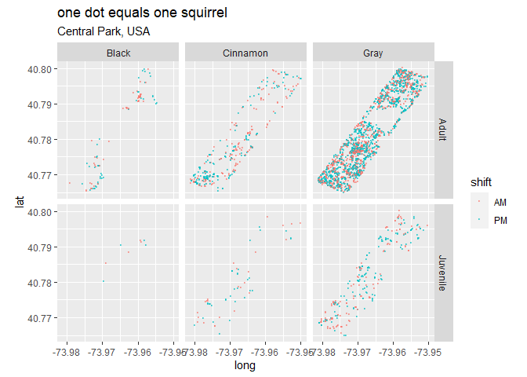

```r
library(tidyverse)
library(lubridate)
```


```r
nyc_squirrels <- readr::read_csv("https://raw.githubusercontent.com/rfordatascience/tidytuesday/master/data/2019/2019-10-29/nyc_squirrels.csv")
```


```r
# clean data
nyc_squirrels$date <- mdy(nyc_squirrels$date)
```


```r
# How many unique squirrels are there in central park?
# 3,018
# There are 5 dulplicate squirrels!
nyc_squirrels %>%
  count(unique_squirrel_id, sort=TRUE)
```

```
## # A tibble: 3,018 x 2
##    unique_squirrel_id     n
##    <chr>              <int>
##  1 1F-AM-1010-04          2
##  2 37E-PM-1006-03         2
##  3 40B-AM-1019-06         2
##  4 4C-PM-1010-05          2
##  5 7D-PM-1010-01          2
##  6 10A-AM-1006-01         1
##  7 10A-AM-1006-02         1
##  8 10A-AM-1006-03         1
##  9 10A-AM-1006-04         1
## 10 10A-PM-1014-01         1
## # ... with 3,008 more rows
```


```r
# Where are the squirrels located?
nyc_squirrels %>%
  select(lat,long)%>%
  summary()
```

```
##       lat             long       
##  Min.   :40.76   Min.   :-73.98  
##  1st Qu.:40.77   1st Qu.:-73.97  
##  Median :40.78   Median :-73.97  
##  Mean   :40.78   Mean   :-73.97  
##  3rd Qu.:40.79   3rd Qu.:-73.96  
##  Max.   :40.80   Max.   :-73.95
```

```r
# Density of squirrels?
nyc_squirrels %>%
  ggplot(aes(long,lat))+
  geom_bin2d()
```

<!-- -->


```r
# What are the most common kinds of squirrel?
# And when do they come out to play?
nyc_squirrels %>%
  filter(!is.na(primary_fur_color)) %>%
  filter(!is.na(shift)) %>%
  filter(!is.na(age))%>%
  filter(age != "?")%>%
  ggplot(aes(primary_fur_color)) +
  facet_grid(shift ~ age)+
  geom_bar(aes(fill=primary_fur_color)) +
  theme(legend.position = "none")
```

<!-- -->


```r
# Where are the juvenile vs. adult squirrels in the AM & PM hours?
# what is their primary_fur_color?
nyc_squirrels %>%
  filter(!is.na(primary_fur_color)) %>%
  filter(!is.na(shift)) %>%
  filter(!is.na(age))%>%
  filter(age != "?")%>%
  ggplot(aes(long, lat)) +
  geom_point(aes(color=primary_fur_color),alpha=0.5) +
  coord_equal() +
  facet_grid(shift ~ age)+
  labs(title="one dot equals one squirrel", 
       subtitle = "Central Park, USA")+
  theme(legend.position = "top")
```

<!-- -->

```r
# primary_fur_color and age by AM or PM
nyc_squirrels %>%
  filter(!is.na(primary_fur_color)) %>%
  filter(!is.na(shift)) %>%
  filter(!is.na(age))%>%
  filter(age != "?")%>%
  ggplot(aes(long, lat)) +
  geom_point(aes(color=shift),alpha=0.5,size=0.1) +
  coord_equal() +
  facet_grid(age ~ primary_fur_color)+
  labs(title="one dot equals one squirrel", 
       subtitle = "Central Park, USA")
```

<!-- -->

