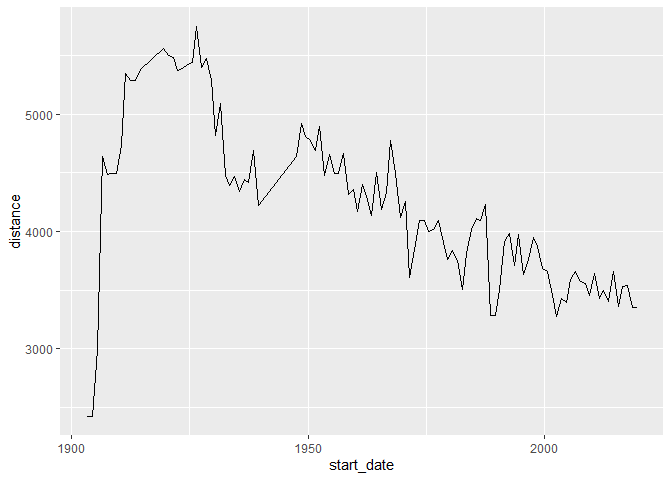
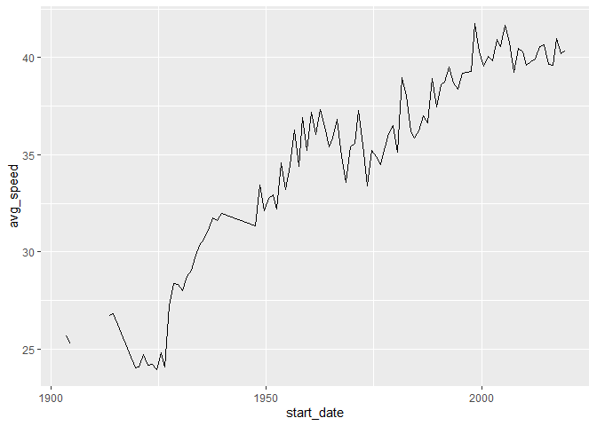

```r
# Get the Data

tdf_winners <- readr::read_csv('https://raw.githubusercontent.com/rfordatascience/tidytuesday/master/data/2020/2020-04-07/tdf_winners.csv')

# libraries
library(tidyverse)
library(lubridate)
library(ggplot2)
```


```r
# clean data
tdf_winners$start_date <- ymd(tdf_winners$start_date)
tdf_winners$born <- ymd(tdf_winners$born)
tdf_winners$died <- ymd(tdf_winners$died)
```


```r
tdf_winners %>%
  ggplot(aes(start_date,distance))+
  geom_line()
```

<!-- -->


```r
tdf_winners %>%
  mutate(avg_speed = distance/time_overall) %>%
  ggplot(aes(start_date,avg_speed))+
  geom_line()
```

<!-- -->


