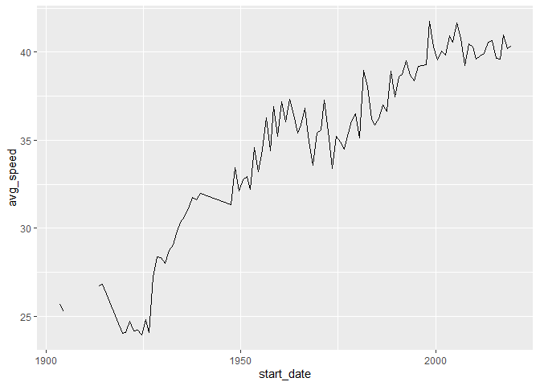
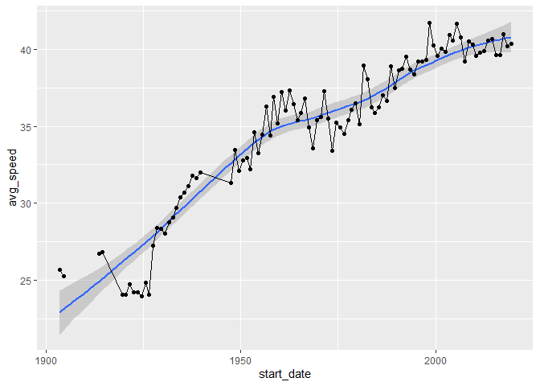
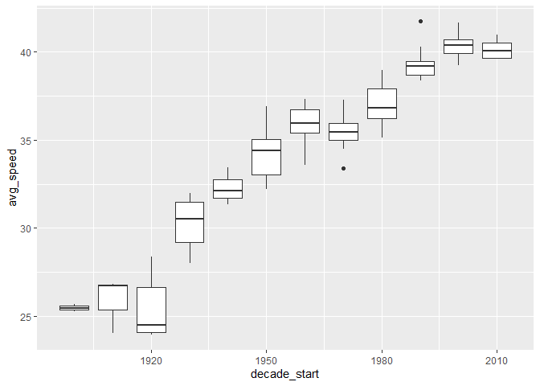
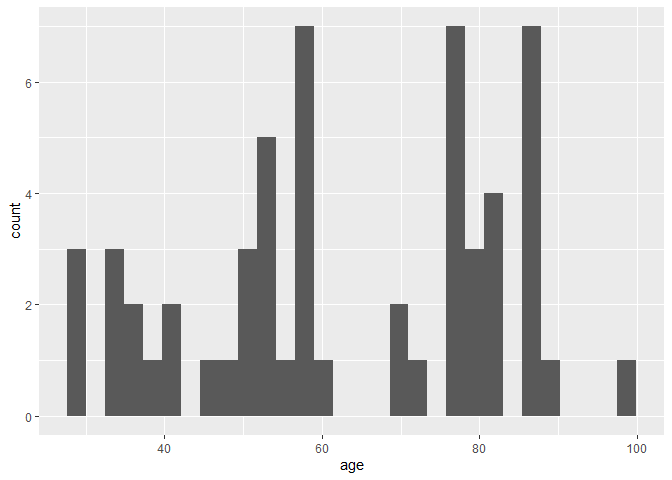

```r
# Get the Data

tdf_winners <- readr::read_csv('https://raw.githubusercontent.com/rfordatascience/tidytuesday/master/data/2020/2020-04-07/tdf_winners.csv')
```


```r
# libraries
library(tidyverse)
library(lubridate)
library(ggplot2)
library(dplyr)
```


```r
# clean data
tdf_winners$start_date <- ymd(tdf_winners$start_date)
tdf_winners$born <- ymd(tdf_winners$born)
tdf_winners$died <- ymd(tdf_winners$died)
```


```r
tdf_winners %>%
  ggplot(aes(start_date,distance))+
  geom_line()
```

<!-- -->


```r
tdf_winners %>%
  mutate(avg_speed = distance/time_overall) %>%
  ggplot(aes(start_date,avg_speed))+
  geom_line()
```

<!-- -->


```r
tdf_winners %>%
  mutate(avg_speed = distance/time_overall) %>%
  ggplot(aes(start_date,avg_speed))+
  geom_smooth()+
  geom_point()+
  geom_line()
```

```
## `geom_smooth()` using method = 'loess' and formula 'y ~ x'
```

<!-- -->

```r
tdf_winners %>%
  mutate(avg_speed = distance/time_overall) %>%
  mutate(decade_start=year(start_date) - year(start_date)%%10) %>%
  ggplot(aes(decade_start,avg_speed,group=decade_start))+
  geom_boxplot()
```

```
## Warning: Removed 8 rows containing non-finite values (stat_boxplot).
```

<!-- -->


```r
tdf_winners %>%
  mutate(age=round(as.numeric(difftime(died,born,"days")/365),1)) %>%
  ggplot(aes(age))+
  geom_histogram()
```

```
## `stat_bin()` using `bins = 30`. Pick better value with `binwidth`.
```

```
## Warning: Removed 50 rows containing non-finite values (stat_bin).
```

<!-- -->

