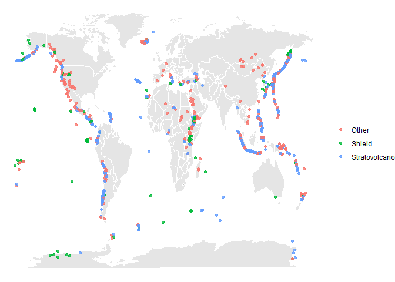
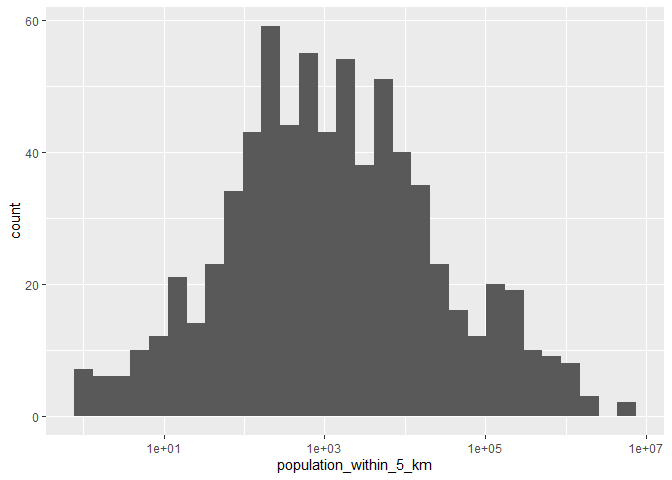
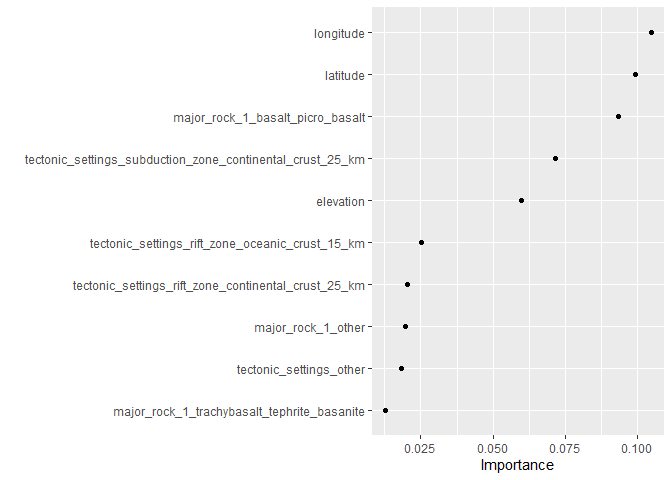
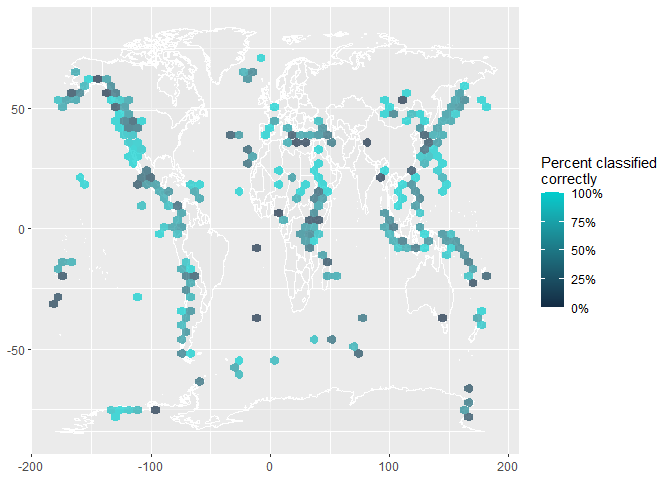

# Exploration and Visualization

Following along the example of David Robinson: 
https://github.com/dgrtwo/data-screencasts/blob/master/volcano-eruptions.Rmd

## Get the data


```r
volcano <- readr::read_csv('https://raw.githubusercontent.com/rfordatascience/tidytuesday/master/data/2020/2020-05-12/volcano.csv')
eruptions <- readr::read_csv('https://raw.githubusercontent.com/rfordatascience/tidytuesday/master/data/2020/2020-05-12/eruptions.csv')
events <- readr::read_csv('https://raw.githubusercontent.com/rfordatascience/tidytuesday/master/data/2020/2020-05-12/events.csv')
tree_rings <- readr::read_csv('https://raw.githubusercontent.com/rfordatascience/tidytuesday/master/data/2020/2020-05-12/tree_rings.csv')
sulfur <- readr::read_csv('https://raw.githubusercontent.com/rfordatascience/tidytuesday/master/data/2020/2020-05-12/sulfur.csv')
```

## Load some Libraries

```r
library(tidyverse)
library(ggplot2)
```

## Changing the eruption year to a number


```r
volcano %>%
  mutate(last_eruption_year = as.numeric(last_eruption_year))
```

```
## Warning: NAs introduced by coercion
```

```
## # A tibble: 958 x 26
##    volcano_number volcano_name primary_volcano~ last_eruption_y~ country region
##             <dbl> <chr>        <chr>                       <dbl> <chr>   <chr> 
##  1         283001 Abu          Shield(s)                   -6850 Japan   Japan~
##  2         355096 Acamarachi   Stratovolcano                  NA Chile   South~
##  3         342080 Acatenango   Stratovolcano(e~             1972 Guatem~ Méxic~
##  4         213004 Acigol-Nevs~ Caldera                     -2080 Turkey  Medit~
##  5         321040 Adams        Stratovolcano                 950 United~ Canad~
##  6         283170 Adatarayama  Stratovolcano(e~             1996 Japan   Japan~
##  7         221170 Adwa         Stratovolcano                  NA Ethiop~ Afric~
##  8         221110 Afdera       Stratovolcano                  NA Ethiop~ Afric~
##  9         284160 Agrigan      Stratovolcano                1917 United~ Japan~
## 10         342100 Agua         Stratovolcano                  NA Guatem~ Méxic~
## # ... with 948 more rows, and 20 more variables: subregion <chr>,
## #   latitude <dbl>, longitude <dbl>, elevation <dbl>, tectonic_settings <chr>,
## #   evidence_category <chr>, major_rock_1 <chr>, major_rock_2 <chr>,
## #   major_rock_3 <chr>, major_rock_4 <chr>, major_rock_5 <chr>,
## #   minor_rock_1 <chr>, minor_rock_2 <chr>, minor_rock_3 <chr>,
## #   minor_rock_4 <chr>, minor_rock_5 <chr>, population_within_5_km <dbl>,
## #   population_within_10_km <dbl>, population_within_30_km <dbl>,
## #   population_within_100_km <dbl>
```

# Plot the number of eruptions by year as a histogram with log10 x axis.


```r
volcano %>%
  count(evidence_category, sort = TRUE)
```

```
## # A tibble: 5 x 2
##   evidence_category      n
##   <chr>              <int>
## 1 Eruption Observed    428
## 2 Eruption Dated       226
## 3 Evidence Credible    193
## 4 Evidence Uncertain    84
## 5 Unrest / Holocene     27
```


```r
volcano %>%
  mutate(years_ago= 2020-as.numeric(last_eruption_year)) %>%
  ggplot(aes(years_ago+1, fill=evidence_category)) +
  geom_histogram()+
  scale_x_log10()
```

```
## Warning: NAs introduced by coercion
```

```
## `stat_bin()` using `bins = 30`. Pick better value with `binwidth`.
```

```
## Warning: Removed 301 rows containing non-finite values (stat_bin).
```

<!-- -->


# Machine Learning

Following along the example of Julia Silge:
https://juliasilge.com/blog/multinomial-volcano-eruptions/ 

## First, let's get the data.

```r
volcano_raw <- readr::read_csv("https://raw.githubusercontent.com/rfordatascience/tidytuesday/master/data/2020/2020-05-12/volcano.csv")
```


## Count the number of primary volcano types

```r
volcano_raw %>%
  count(primary_volcano_type, sort = TRUE)
```

```
## # A tibble: 26 x 2
##    primary_volcano_type     n
##    <chr>                <int>
##  1 Stratovolcano          353
##  2 Stratovolcano(es)      107
##  3 Shield                  85
##  4 Volcanic field          71
##  5 Pyroclastic cone(s)     70
##  6 Caldera                 65
##  7 Complex                 46
##  8 Shield(s)               33
##  9 Submarine               27
## 10 Lava dome(s)            26
## # ... with 16 more rows
```

## Too many volcano types

See the code below to see how to reduce the number of volcano types to the two most common plus "other". 


```r
volcano_df <- volcano_raw %>% # create a new dataframe named volcano_df
  transmute( # transmute() is a dplyr functino that adds new variables 
    # and drops existing ones while preserving the number of rows. 
    # The New variables overwrite existing variables of the same name.
    volcano_type = case_when( # "stratovoclano" and "shield" are the new variable names 
      # to collect Stratovolcano(es) and "stratovolcano" into one variable. 
      #All other varialbes beyond that and "sheild" are simply named "other". 
      str_detect(primary_volcano_type, "Stratovolcano") ~ "Stratovolcano",
      str_detect(primary_volcano_type, "Shield") ~ "Shield",
      TRUE ~ "Other"
    ), # We still want to keep the following fields. 
    volcano_number, latitude, longitude, elevation,
    tectonic_settings, major_rock_1
  ) %>% 
  mutate_if(is.character, factor) #if a column contains characters, 
#it's automatically a factor. 
volcano_df %>%
  count(volcano_type, sort = TRUE)  #Now count the types of volcano according to the new grouping
```

```
## # A tibble: 3 x 2
##   volcano_type      n
##   <fct>         <int>
## 1 Stratovolcano   461
## 2 Other           379
## 3 Shield          118
```

## Let's build a map!


```r
world <- map_data("world")

ggplot() +
  geom_map(
    data = world, map = world,
    aes(long, lat, map_id = region),
    color = "white", fill = "gray50", size = 0.5, alpha = 0.2
  ) +
  geom_point(
    data = volcano_df,
    aes(longitude, latitude, color = volcano_type),
    alpha = 0.8
  ) +
  #theme_void(base_family = "IBMPlexSans") +
  labs(x = NULL, y = NULL, color = NULL)
```

<!-- -->


# Bootstrap resample time!


```r
library(tidymodels)
volcano_boot <- bootstraps(volcano_df)

volcano_boot
```

```
## # Bootstrap sampling 
## # A tibble: 25 x 2
##    splits            id         
##    <list>            <chr>      
##  1 <split [958/346]> Bootstrap01
##  2 <split [958/338]> Bootstrap02
##  3 <split [958/362]> Bootstrap03
##  4 <split [958/352]> Bootstrap04
##  5 <split [958/363]> Bootstrap05
##  6 <split [958/345]> Bootstrap06
##  7 <split [958/359]> Bootstrap07
##  8 <split [958/354]> Bootstrap08
##  9 <split [958/369]> Bootstrap09
## 10 <split [958/334]> Bootstrap10
## # ... with 15 more rows
```


```r
library(themis)

volcano_rec <- recipe(volcano_type ~ ., data = volcano_df) %>%
  update_role(volcano_number, new_role = "Id") %>%
  step_other(tectonic_settings) %>%
  step_other(major_rock_1) %>%
  step_dummy(tectonic_settings, major_rock_1) %>%
  step_zv(all_predictors()) %>%
  step_normalize(all_predictors()) %>%
  step_smote(volcano_type)
```


```r
volcano_prep <- prep(volcano_rec)
juice(volcano_prep)
```

```
## # A tibble: 1,383 x 14
##    volcano_number latitude longitude elevation volcano_type tectonic_settin~
##             <dbl>    <dbl>     <dbl>     <dbl> <fct>                   <dbl>
##  1         213004   0.746      0.101   -0.131  Other                  -0.289
##  2         284141   0.172      1.11    -1.39   Other                  -0.289
##  3         282080   0.526      0.975   -0.535  Other                  -0.289
##  4         285070   0.899      1.10    -0.263  Other                  -0.289
##  5         320020   1.44      -1.45     0.250  Other                  -0.289
##  6         221060  -0.0377     0.155   -0.920  Other                  -0.289
##  7         273088   0.0739     0.888    0.330  Other                  -0.289
##  8         266020  -0.451      0.918   -0.0514 Other                  -0.289
##  9         233011  -0.873      0.233   -0.280  Other                  -0.289
## 10         257040  -0.989      1.32    -0.380  Other                  -0.289
## # ... with 1,373 more rows, and 8 more variables:
## #   tectonic_settings_Rift.zone...Oceanic.crust....15.km. <dbl>,
## #   tectonic_settings_Subduction.zone...Continental.crust...25.km. <dbl>,
## #   tectonic_settings_Subduction.zone...Oceanic.crust....15.km. <dbl>,
## #   tectonic_settings_other <dbl>, major_rock_1_Basalt...Picro.Basalt <dbl>,
## #   major_rock_1_Dacite <dbl>,
## #   major_rock_1_Trachybasalt...Tephrite.Basanite <dbl>,
## #   major_rock_1_other <dbl>
```

> *The ranger implementation for random forest can handle multinomial classification without any special handling.* - Julia Silge


```r
rf_spec <- rand_forest(trees = 1000) %>%
  set_mode("classification") %>%
  set_engine("ranger")

volcano_wf <- workflow() %>%
  add_recipe(volcano_rec) %>%
  add_model(rf_spec)

volcano_wf
```

```
## == Workflow ==============================================================================================
## Preprocessor: Recipe
## Model: rand_forest()
## 
## -- Preprocessor ------------------------------------------------------------------------------------------
## 6 Recipe Steps
## 
## * step_other()
## * step_other()
## * step_dummy()
## * step_zv()
## * step_normalize()
## * step_smote()
## 
## -- Model -------------------------------------------------------------------------------------------------
## Random Forest Model Specification (classification)
## 
## Main Arguments:
##   trees = 1000
## 
## Computational engine: ranger
```

## Fitting the workflow to the resamples


```r
volcano_res <- fit_resamples(
  volcano_wf,
  resamples = volcano_boot,
  control = control_resamples(save_pred = TRUE)
)
```

## Explore results


```r
volcano_res %>%
  collect_metrics()
```

```
## # A tibble: 2 x 5
##   .metric  .estimator  mean     n std_err
##   <chr>    <chr>      <dbl> <int>   <dbl>
## 1 accuracy multiclass 0.655    25 0.00351
## 2 roc_auc  hand_till  0.796    25 0.00382
```

## Confusion matrix


```r
volcano_res %>%
  collect_predictions() %>%
  conf_mat(volcano_type, .pred_class)
```

```
##                Truth
## Prediction      Other Shield Stratovolcano
##   Other          1983    304           793
##   Shield          274    563           202
##   Stratovolcano  1293    205          3276
```

## Grouping by resample


```r
volcano_res %>%
  collect_predictions() %>%
  group_by(id) %>%
  ppv(volcano_type, .pred_class)
```

```
## # A tibble: 25 x 4
##    id          .metric .estimator .estimate
##    <chr>       <chr>   <chr>          <dbl>
##  1 Bootstrap01 ppv     macro          0.631
##  2 Bootstrap02 ppv     macro          0.650
##  3 Bootstrap03 ppv     macro          0.628
##  4 Bootstrap04 ppv     macro          0.614
##  5 Bootstrap05 ppv     macro          0.608
##  6 Bootstrap06 ppv     macro          0.639
##  7 Bootstrap07 ppv     macro          0.612
##  8 Bootstrap08 ppv     macro          0.619
##  9 Bootstrap09 ppv     macro          0.627
## 10 Bootstrap10 ppv     macro          0.606
## # ... with 15 more rows
```

## Which variables are important? 


```r
library(vip)

rf_spec %>%
  set_engine("ranger", importance = "permutation") %>%
  fit(
    volcano_type ~ .,
    data = juice(volcano_prep) %>%
      select(-volcano_number) %>%
      janitor::clean_names()
  ) %>%
  vip(geom = "point")
```

<!-- -->


```r
volcano_pred <- volcano_res %>%
  collect_predictions() %>%
  mutate(correct = volcano_type == .pred_class) %>%
  left_join(volcano_df %>%
    mutate(.row = row_number()))
```

```
## Joining, by = c(".row", "volcano_type")
```

```r
volcano_pred
```

```
## # A tibble: 8,893 x 14
##    id    .pred_Other .pred_Shield .pred_Stratovol~  .row .pred_class
##    <chr>       <dbl>        <dbl>            <dbl> <int> <fct>      
##  1 Boot~      0.312        0.0140           0.674      2 Stratovolc~
##  2 Boot~      0.300        0.0538           0.646      5 Stratovolc~
##  3 Boot~      0.179        0.0862           0.735      6 Stratovolc~
##  4 Boot~      0.272        0.0872           0.641      7 Stratovolc~
##  5 Boot~      0.228        0.0957           0.677      9 Stratovolc~
##  6 Boot~      0.197        0.0253           0.777     10 Stratovolc~
##  7 Boot~      0.367        0.0191           0.613     21 Stratovolc~
##  8 Boot~      0.0197       0.954            0.0266    25 Shield     
##  9 Boot~      0.270        0.0596           0.671     27 Stratovolc~
## 10 Boot~      0.0639       0.896            0.0401    31 Shield     
## # ... with 8,883 more rows, and 8 more variables: volcano_type <fct>,
## #   correct <lgl>, volcano_number <dbl>, latitude <dbl>, longitude <dbl>,
## #   elevation <dbl>, tectonic_settings <fct>, major_rock_1 <fct>
```


```r
ggplot() +
  geom_map(
    data = world, map = world,
    aes(long, lat, map_id = region),
    color = "white", fill = "gray90", size = 0.05, alpha = 0.5
  ) +
  stat_summary_hex(
    data = volcano_pred,
    aes(longitude, latitude, z = as.integer(correct)),
    fun = "mean",
    alpha = 0.7, bins = 50
  ) +
  scale_fill_gradient(high = "cyan3", labels = scales::percent) +
  #theme_void(base_family = "IBMPlexSans") +
  labs(x = NULL, y = NULL, fill = "Percent classified\ncorrectly")
```

```
## Warning: Ignoring unknown aesthetics: x, y
```

<!-- -->

