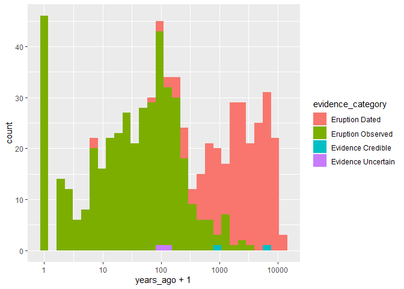

Following along the example of Julia Silge:
https://juliasilge.com/blog/multinomial-volcano-eruptions/ 

## First, let's get the data.

```r
volcano_raw <- readr::read_csv("https://raw.githubusercontent.com/rfordatascience/tidytuesday/master/data/2020/2020-05-12/volcano.csv")
```

## Load some Libraries

```r
library(tidyverse)
```

## Count the number of primary volcano types

```r
volcano_raw %>%
  count(primary_volcano_type, sort = TRUE)
```

```
## # A tibble: 26 x 2
##    primary_volcano_type     n
##    <chr>                <int>
##  1 Stratovolcano          353
##  2 Stratovolcano(es)      107
##  3 Shield                  85
##  4 Volcanic field          71
##  5 Pyroclastic cone(s)     70
##  6 Caldera                 65
##  7 Complex                 46
##  8 Shield(s)               33
##  9 Submarine               27
## 10 Lava dome(s)            26
## # ... with 16 more rows
```

## Too many volcano types

See the code below to see how to reduce the number of volcano types to the two most common plus "other". 


```r
volcano_df <- volcano_raw %>% # create a new dataframe named volcano_df
  transmute( # transmute() is a dplyr functino that adds new variables 
    # and drops existing ones while preserving the number of rows. 
    # The New variables overwrite existing variables of the same name.
    volcano_type = case_when( # "stratovoclano" and "shield" are the new variable names 
      # to collect Stratovolcano(es) and "stratovolcano" into one variable. 
      #All other varialbes beyond that and "sheild" are simply named "other". 
      str_detect(primary_volcano_type, "Stratovolcano") ~ "Stratovolcano",
      str_detect(primary_volcano_type, "Shield") ~ "Shield",
      TRUE ~ "Other"
    ), # We still want to keep the following fields. 
    volcano_number, latitude, longitude, elevation,
    tectonic_settings, major_rock_1
  ) %>% 
  mutate_if(is.character, factor) #if a column contains characters, 
#it's automatically a factor. 
volcano_df %>%
  count(volcano_type, sort = TRUE)  #Now count the types of volcano according to the new grouping
```

```
## # A tibble: 3 x 2
##   volcano_type      n
##   <fct>         <int>
## 1 Stratovolcano   461
## 2 Other           379
## 3 Shield          118
```

## Let's build a map!


```r
world <- map_data("world")

ggplot() +
  geom_map(
    data = world, map = world,
    aes(long, lat, map_id = region),
    color = "white", fill = "gray50", size = 0.5, alpha = 0.2
  ) +
  geom_point(
    data = volcano_df,
    aes(longitude, latitude, color = volcano_type),
    alpha = 0.8
  ) +
  #theme_void(base_family = "IBMPlexSans") +
  labs(x = NULL, y = NULL, color = NULL)
```

<!-- -->


# Bootstrap resample time!


```r
library(tidymodels)
volcano_boot <- bootstraps(volcano_df)

volcano_boot
```

```
## # Bootstrap sampling 
## # A tibble: 25 x 2
##    splits            id         
##    <list>            <chr>      
##  1 <split [958/356]> Bootstrap01
##  2 <split [958/337]> Bootstrap02
##  3 <split [958/356]> Bootstrap03
##  4 <split [958/333]> Bootstrap04
##  5 <split [958/357]> Bootstrap05
##  6 <split [958/351]> Bootstrap06
##  7 <split [958/369]> Bootstrap07
##  8 <split [958/340]> Bootstrap08
##  9 <split [958/348]> Bootstrap09
## 10 <split [958/359]> Bootstrap10
## # ... with 15 more rows
```


```r
library(themis)

volcano_rec <- recipe(volcano_type ~ ., data = volcano_df) %>%
  update_role(volcano_number, new_role = "Id") %>%
  step_other(tectonic_settings) %>%
  step_other(major_rock_1) %>%
  step_dummy(tectonic_settings, major_rock_1) %>%
  step_zv(all_predictors()) %>%
  step_normalize(all_predictors()) %>%
  step_smote(volcano_type)
```


```r
volcano_prep <- prep(volcano_rec)
juice(volcano_prep)
```

```
## # A tibble: 1,383 x 14
##    volcano_number latitude longitude elevation volcano_type tectonic_settin~
##             <dbl>    <dbl>     <dbl>     <dbl> <fct>                   <dbl>
##  1         213004   0.746      0.101   -0.131  Other                  -0.289
##  2         284141   0.172      1.11    -1.39   Other                  -0.289
##  3         282080   0.526      0.975   -0.535  Other                  -0.289
##  4         285070   0.899      1.10    -0.263  Other                  -0.289
##  5         320020   1.44      -1.45     0.250  Other                  -0.289
##  6         221060  -0.0377     0.155   -0.920  Other                  -0.289
##  7         273088   0.0739     0.888    0.330  Other                  -0.289
##  8         266020  -0.451      0.918   -0.0514 Other                  -0.289
##  9         233011  -0.873      0.233   -0.280  Other                  -0.289
## 10         257040  -0.989      1.32    -0.380  Other                  -0.289
## # ... with 1,373 more rows, and 8 more variables:
## #   tectonic_settings_Rift.zone...Oceanic.crust....15.km. <dbl>,
## #   tectonic_settings_Subduction.zone...Continental.crust...25.km. <dbl>,
## #   tectonic_settings_Subduction.zone...Oceanic.crust....15.km. <dbl>,
## #   tectonic_settings_other <dbl>, major_rock_1_Basalt...Picro.Basalt <dbl>,
## #   major_rock_1_Dacite <dbl>,
## #   major_rock_1_Trachybasalt...Tephrite.Basanite <dbl>,
## #   major_rock_1_other <dbl>
```

> *The ranger implementation for random forest can handle multinomial classification without any special handling.* - Julia Silge


```r
rf_spec <- rand_forest(trees = 1000) %>%
  set_mode("classification") %>%
  set_engine("ranger")

volcano_wf <- workflow() %>%
  add_recipe(volcano_rec) %>%
  add_model(rf_spec)

volcano_wf
```

```
## == Workflow ==============================================================================================
## Preprocessor: Recipe
## Model: rand_forest()
## 
## -- Preprocessor ------------------------------------------------------------------------------------------
## 6 Recipe Steps
## 
## * step_other()
## * step_other()
## * step_dummy()
## * step_zv()
## * step_normalize()
## * step_smote()
## 
## -- Model -------------------------------------------------------------------------------------------------
## Random Forest Model Specification (classification)
## 
## Main Arguments:
##   trees = 1000
## 
## Computational engine: ranger
```

## Fitting the workflow to the resamples


```r
volcano_res <- fit_resamples(
  volcano_wf,
  resamples = volcano_boot,
  control = control_resamples(save_pred = TRUE)
)
```

## Explore results


```r
volcano_res %>%
  collect_metrics()
```

```
## # A tibble: 2 x 5
##   .metric  .estimator  mean     n std_err
##   <chr>    <chr>      <dbl> <int>   <dbl>
## 1 accuracy multiclass 0.658    25 0.00453
## 2 roc_auc  hand_till  0.794    25 0.00402
```

## Confusion matrix


```r
volcano_res %>%
  collect_predictions() %>%
  conf_mat(volcano_type, .pred_class)
```

```
##                Truth
## Prediction      Other Shield Stratovolcano
##   Other          1941    314           776
##   Shield          231    561           184
##   Stratovolcano  1281    207          3251
```

## Grouping by resample


```r
volcano_res %>%
  collect_predictions() %>%
  group_by(id) %>%
  ppv(volcano_type, .pred_class)
```

```
## # A tibble: 25 x 4
##    id          .metric .estimator .estimate
##    <chr>       <chr>   <chr>          <dbl>
##  1 Bootstrap01 ppv     macro          0.635
##  2 Bootstrap02 ppv     macro          0.669
##  3 Bootstrap03 ppv     macro          0.628
##  4 Bootstrap04 ppv     macro          0.581
##  5 Bootstrap05 ppv     macro          0.649
##  6 Bootstrap06 ppv     macro          0.631
##  7 Bootstrap07 ppv     macro          0.633
##  8 Bootstrap08 ppv     macro          0.575
##  9 Bootstrap09 ppv     macro          0.666
## 10 Bootstrap10 ppv     macro          0.640
## # ... with 15 more rows
```

## Which variables are important? 


```r
library(vip)

rf_spec %>%
  set_engine("ranger", importance = "permutation") %>%
  fit(
    volcano_type ~ .,
    data = juice(volcano_prep) %>%
      select(-volcano_number) %>%
      janitor::clean_names()
  ) %>%
  vip(geom = "point")
```

<!-- -->


```r
volcano_pred <- volcano_res %>%
  collect_predictions() %>%
  mutate(correct = volcano_type == .pred_class) %>%
  left_join(volcano_df %>%
    mutate(.row = row_number()))
```

```
## Joining, by = c(".row", "volcano_type")
```

```r
volcano_pred
```

```
## # A tibble: 8,746 x 14
##    id    .pred_Other .pred_Shield .pred_Stratovol~  .row .pred_class
##    <chr>       <dbl>        <dbl>            <dbl> <int> <fct>      
##  1 Boot~       0.234       0.0645            0.701     5 Stratovolc~
##  2 Boot~       0.201       0.112             0.688    11 Stratovolc~
##  3 Boot~       0.508       0.0164            0.476    12 Other      
##  4 Boot~       0.518       0.0236            0.459    14 Other      
##  5 Boot~       0.297       0.135             0.568    19 Stratovolc~
##  6 Boot~       0.315       0.0311            0.654    21 Stratovolc~
##  7 Boot~       0.324       0.0970            0.579    23 Stratovolc~
##  8 Boot~       0.190       0.442             0.368    24 Shield     
##  9 Boot~       0.163       0.542             0.295    26 Shield     
## 10 Boot~       0.276       0.0660            0.658    27 Stratovolc~
## # ... with 8,736 more rows, and 8 more variables: volcano_type <fct>,
## #   correct <lgl>, volcano_number <dbl>, latitude <dbl>, longitude <dbl>,
## #   elevation <dbl>, tectonic_settings <fct>, major_rock_1 <fct>
```


```r
ggplot() +
  geom_map(
    data = world, map = world,
    aes(long, lat, map_id = region),
    color = "white", fill = "gray90", size = 0.05, alpha = 0.5
  ) +
  stat_summary_hex(
    data = volcano_pred,
    aes(longitude, latitude, z = as.integer(correct)),
    fun = "mean",
    alpha = 0.7, bins = 50
  ) +
  scale_fill_gradient(high = "cyan3", labels = scales::percent) +
  #theme_void(base_family = "IBMPlexSans") +
  labs(x = NULL, y = NULL, fill = "Percent classified\ncorrectly")
```

```
## Warning: Ignoring unknown aesthetics: x, y
```

<!-- -->

